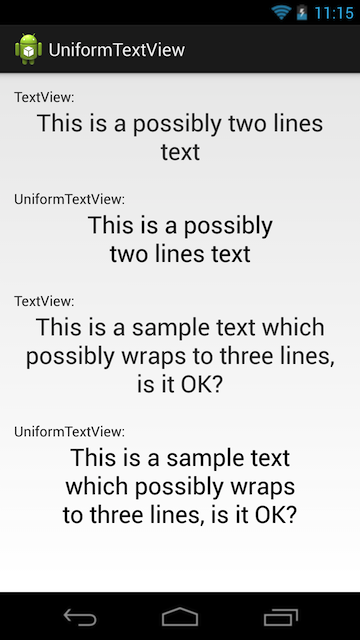

UniformTextView
===============

Android's TextView which wraps text in nicer way than the default.
One picture tells more than thousand words:

This is answer for my question on [stackoverflow.com](http://stackoverflow.com/questions/19756126/uniform-text-wrapping-in-textview)
